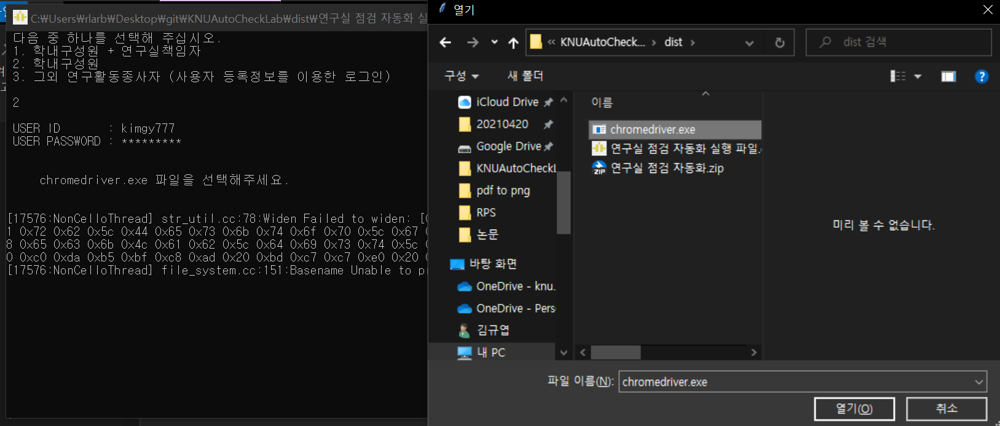

<!-- # KNUAutoCheckLab -->

<p align="center">
  <!-- <a href="https://github.com/othneildrew/Best-README-Template"> -->
    <!--  -->
  </a>

  <h3 align="center">KNU Auto Lab Check</h3>

  <!-- <p align="center">
    Follow the youtube channel's paper reviews!
    <br />
    <strong>Explore the youtube channel »</strong></a>
    <br />
    <br />
    <a href="https://www.youtube.com/playlist?list=PLWKf9beHi3Tg50UoyTe6rIm20sVQOH1br">Pr12 Season 1</a>
    ·
    <a href="https://www.youtube.com/playlist?list=PLWKf9beHi3TgstcIn8K6dI_85_ppAxzB8">Season 2 </a>
    ·
    <a href="https://www.youtube.com/playlist?list=PL_skMddDjnzq1wDI3t2cH9hlK6wBBapeA">Season 3</a>
    ·
    <a href="https://www.youtube.com/playlist?list=PL0o99tZwBlrMV3QsZ4O79KjMHDhAJpAdW">Season 4</a>
  </p>
</p> -->


<!-- TABLE OF CONTENTS -->
<details open="open">
  <summary>Table of Contents</summary>
  <ol>
    <li>
      <a href="#about-the-project">About The Project</a>
      <!-- <ul>
        <li><a href="#built-with">Built With</a></li>
      </ul> -->
    </li>
    <!-- <li>
      <a href="#getting-started">Getting Started</a>
      <ul>
        <li><a href="#prerequisites">Prerequisites</a></li>
        <li><a href="#installation">Installation</a></li>
      </ul>
    </li> -->
    <li><a href="#usage">Usage</a></li>
    <!-- <li><a href="#roadmap">Roadmap</a></li>
    <li><a href="#contributing">Contributing</a></li>
    <li><a href="#license">License</a></li> -->
    <li><a href="#contact">Contact</a></li>
    <li><a href="#contact">Citation</a></li>
    <!-- <li><a href="#acknowledgements">Acknowledgements</a></li>
  </ol> -->
</details>


<!-- ABOUT THE PROJECT -->
## About The Project

<!-- [![Product Name Screen Shot][product-screenshot]](https://example.com) -->


Department of mathematics has no dangerous experiment tool except for the corruption of our mental during study; so having a dangerous thought.

But, it is an obligation for us to check some kinds of inspection items which are "absolutely regardless of our work". Even the items are the same everyday. We dare to say it is corrupting our mental with hard work for studying at the same time.

To avoid this kinds of useless things, we made an automatic check system. You can find how to use this on below. Hope you guys save both your mental and time.


<!-- There are many great README templates available on GitHub, however, I didn't find one that really suit my needs so I created this enhanced one. I want to create a README template so amazing that it'll be the last one you ever need -- I think this is it.

Here's why:
* Your time should be focused on creating something amazing. A project that solves a problem and helps others
* You shouldn't be doing the same tasks over and over like creating a README from scratch
* You should element DRY principles to the rest of your life :smile:

Of course, no one template will serve all projects since your needs may be different. So I'll be adding more in the near future. You may also suggest changes by forking this repo and creating a pull request or opening an issue. Thanks to all the people have have contributed to expanding this template!

A list of commonly used resources that I find helpful are listed in the acknowledgements. -->


<!-- LICENSE -->
<!-- ## License

Distributed under the MIT License. See `LICENSE` for more information. -->


## Usage

You can use python file or .exe file. We recommend you to use .exe file. Download the folder 'Lab Automation' or zip file 'Lab Automation.zip' and execute 'Lab Automation'. If you execute 'Lab Automation.exe' file, you will face the following image.


We enclosed chromedriver.exe (only chrome 90 version if you don't use chrome 90 version, you should download chromedriver.exe with regard to yours).
Follow the next steps
1. execute Lab Automation.exe.
2. select user type, '1' : 'student+in charge', '2' : 'student', '3' : 'others'
3. enter ID
4. enter PASSWORD
5. select chromedriver.exe (automatically pop up)

*Note
If it doesn't work, it is most likely because your current version of chrome is different with chrome 90 version; so you should download another chromedriver.

Download chromedriver with respect to your current chrome version. You can check your chrome version in the following way open chrome -> help -> chrome info
and download the chromedriver on the website https://chromedriver.chromium.org/downloads.

<!-- CONTACT -->
## Contact

Gyuyeop Kim : rlarbduq777@gmail.com

MJ : know901122@gmail.com

## Citation
```
@misc{
  author = {MJ, Gyuyeop Kim},
  title = {KNUAutoCheckLab},
  year = {2021},
  publisher = {GitHub},
  journal = {GitHub repository},
  howpublished = {\url{https://github.com/KMJ90122/KNUAutoCheckLab}}
}
```
